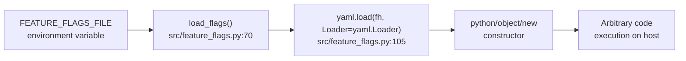

# Arbitrary code execution in PyYAML 5.3.1 — CVE-2020-14343

    

A vulnerability was discovered in the PyYAML library in versions before 5.4, where it is susceptible to arbitrary code execution when it processes untrusted YAML files through the `full_load` method or with the `FullLoader` loader. Applications that use the library to process untrusted input may be vulnerable to this flaw. This flaw allows an attacker to execute arbitrary code on the system by abusing the `python/object/new` constructor. This flaw is due to an incomplete fix for GHSA-6757-jp84-gxfx.

## High Level Details

|                             |                                                                          |
|-----------------------------|--------------------------------------------------------------------------|
| **Affected component**      | `pyproject.toml` → `pyyaml==5.3.1` (direct dependency)                    |
| **Vulnerability**           | [CVE-2020-14343](https://nvd.nist.gov/vuln/detail/CVE-2020-14343) — CWE-502 deserialisation |
| **CVSS 3.1**                | **9.8 Critical** · `CVSS:3.1/AV:N/AC:L/PR:N/UI:N/S:U/C:H/I:H/A:H`         |
| **Fixed in**                | PyYAML 5.4 (current stable line: 6.x)                                     |
| **Remediation**             | Bump the pin and switch the call site to `yaml.safe_load()`               |
| **Effort**                  | Low — one pin, one lock regeneration, one call-site change                 |
| **Detected by**             | Snyk Open Source (SCA) · nightly scheduled scan                           |

## Finding

PyYAML before 5.4 is vulnerable to [CVE-2020-14343](https://nvd.nist.gov/vuln/detail/CVE-2020-14343). When `full_load()` or the `FullLoader` loader parses untrusted YAML, the `python/object/new` constructor can be abused to execute arbitrary code on the host. This is an incomplete fix for GHSA-6757-jp84-gxfx.

The pin in `pyproject.toml` is `5.3.1`, which is below the fixed 5.4.

<b>Data flow</b> — untrusted path to code execution

Dependency path: `yul-agentic → pyyaml@5.3.1` (direct).

## Acceptance criteria

- [ ] `pyproject.toml` pins `pyyaml>=6.0`.
- [ ] `uv.lock` and `requirements.txt` are regenerated against the new pin.
- [ ] `load_flags()` uses `yaml.safe_load()`; no `yaml.Loader` or `FullLoader` remains in `src/`.
- [ ] The application boots and `feature_flags.yml` still loads with all flags intact.
- [ ] The test suite passes on PyYAML 6.x.

## References

- [GitHub Advisory GHSA-8q59-q68h-6hv4](https://github.com/advisories/GHSA-8q59-q68h-6hv4)
- [National Vulnerability Database — CVE-2020-14343](https://nvd.nist.gov/vuln/detail/CVE-2020-14343)
- [CWE-502: Deserialization of Untrusted Data](https://cwe.mitre.org/data/definitions/502.html)
