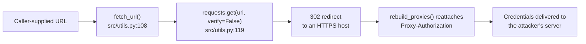

# `Proxy-Authorization` leaked on HTTPS redirect in requests 2.27.1 — CVE-2023-32681

    

Requests is an HTTP library. Since version 2.3.0, Requests has been leaking `Proxy-Authorization` headers to destination servers when redirected to an HTTPS endpoint. This is a product of how `rebuild_proxies` reattaches the `Proxy-Authorization` header to requests. For HTTP connections sent through the tunnel, the proxy will identify the header in the request itself and remove it prior to forwarding to the destination server. However when sent over HTTPS, the `Proxy-Authorization` header must be sent in the CONNECT request as the proxy has no visibility into the tunneled request. This results in Requests forwarding proxy credentials to the destination server unintentionally, allowing a malicious actor to potentially exfiltrate sensitive information.

## High Level Details

|                             |                                                                          |
|-----------------------------|--------------------------------------------------------------------------|
| **Affected component**      | `pyproject.toml` → `requests==2.27.1` (direct dependency)                 |
| **Vulnerability**           | [CVE-2023-32681](https://nvd.nist.gov/vuln/detail/CVE-2023-32681) — CWE-200 credential exposure |
| **CVSS 3.1**                | **6.1 Medium** · `CVSS:3.1/AV:N/AC:H/PR:H/UI:N/S:C/C:H/I:N/A:N`           |
| **Fixed in**                | requests 2.31.0                                                           |
| **Remediation**             | Bump the pin and regenerate the lock file                                 |
| **Effort**                  | Low — API-compatible, no call-site changes expected                       |
| **Detected by**             | Snyk Open Source (SCA) · nightly scheduled scan                           |

## Finding

Requests before 2.31.0 is vulnerable to [CVE-2023-32681](https://nvd.nist.gov/vuln/detail/CVE-2023-32681). When a request is redirected to an HTTPS endpoint, `rebuild_proxies()` reattaches the `Proxy-Authorization` header, which is then delivered to the destination server rather than being consumed by the proxy. Any actor controlling a redirect target can harvest the proxy credentials.

The pin in `pyproject.toml` is `2.27.1`, which is below the fixed 2.31.0.

<b>Data flow</b> — caller-supplied URL to credential disclosure

Dependency path: `yul-agentic → requests@2.27.1` (direct).

## Acceptance criteria

- [ ] `pyproject.toml` pins `requests>=2.31.0`.
- [ ] `uv.lock` and `requirements.txt` are regenerated against the new pin.
- [ ] No call-site changes were needed at `src/utils.py:119` — if any were, they are called out in the PR.
- [ ] The test suite passes on requests 2.31.x.
- [ ] The SSRF and `verify=False` weaknesses on the same call are left untouched — they are tracked separately (§8).

## References

- [GitHub Advisory GHSA-j8r2-6x86-q33q](https://github.com/advisories/GHSA-j8r2-6x86-q33q)
- [National Vulnerability Database — CVE-2023-32681](https://nvd.nist.gov/vuln/detail/CVE-2023-32681)
