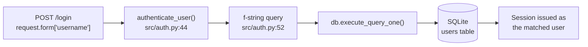

# SQL injection in `authenticate_user()` — CWE-89

    

Improper Neutralization of Special Elements used in an SQL Command ('SQL Injection'). The application constructs all or part of an SQL command using externally-influenced input, but does not neutralize or incorrectly neutralizes special elements that could modify the intended SQL command when it is sent to a downstream component. Without sufficient removal or quoting of SQL syntax, the generated query can cause those elements to be interpreted as SQL instead of ordinary user data.

## High Level Details

|                             |                                                                          |
|-----------------------------|--------------------------------------------------------------------------|
| **Affected component**      | `src/auth.py` → `authenticate_user()` and four sibling functions          |
| **Weakness**                | [CWE-89](https://cwe.mitre.org/data/definitions/89.html) — SQL Injection  |
| **CVSS 3.1**                | **9.8 Critical** · `CVSS:3.1/AV:N/AC:L/PR:N/UI:N/S:U/C:H/I:H/A:H`         |
| **Attack prerequisites**    | None — pre-authentication, reachable from the public login form           |
| **Remediation**             | Parameterise every query in `src/auth.py`                                 |
| **Effort**                  | Low — the correct pattern already exists in the same file                 |
| **Detected by**             | Snyk Code (SAST) · rule `python/SqlInjection`                             |

## Finding

`authenticate_user()` builds the login query by interpolating the submitted username and password hash directly into an f-string:

```python
# src/auth.py:52
query = f"SELECT * FROM users WHERE username = '{username}' AND password = '{hash_password(password)}'"
```

A username of `admin' OR '1'='1` terminates the quoted literal and appends an always-true predicate, returning the first row of the `users` table and authenticating the request as that user without any valid credential. The same string-interpolation pattern appears in `get_user_by_session_token()`, `change_password()`, `get_user_by_id()` and `get_user_by_username()` in the same module, so session lookup and account enumeration are equally injectable.

<details open>
<summary><b>Data flow</b> — untrusted input to query execution</summary>



**7 steps** · source `src/__init__.py:135` → sink `src/auth.py:55` · no sanitiser on the path.

</details>

## Why it matters here

This is pre-authentication and reachable from the public login form — no account is needed to exploit it. Beyond the authentication bypass, `UNION SELECT` payloads against the same entry point read arbitrary tables, including the `users` table's stored password hashes.

`docs/VULNERABILITIES.md` §1 catalogues this weakness and lists `src/database.py` and `src/models.py` as carrying the same pattern. This report is scoped to **`src/auth.py`** so the fix stays reviewable; the data-access layer should be tracked separately.

## Acceptance criteria

- [ ] `authenticate_user()` passes bind parameters to `db.execute_query_one()` — no f-string interpolation.
- [ ] The same fix is applied to `get_user_by_session_token()`, `change_password()`, `get_user_by_id()` and `get_user_by_username()`.
- [ ] No f-string or `%`-formatted SQL remains anywhere in `src/auth.py`.
- [ ] A username of `admin' OR '1'='1` no longer authenticates.
- [ ] The existing tests in `tests/test_auth.py` pass unchanged.

## References

- [CWE-89: SQL Injection](https://cwe.mitre.org/data/definitions/89.html)
- [OWASP SQL Injection Prevention Cheat Sheet](https://cheatsheetseries.owasp.org/cheatsheets/SQL_Injection_Prevention_Cheat_Sheet.html)
