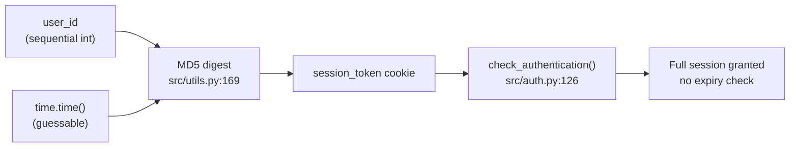

# Predictable session tokens in `generate_session_token()` — CWE-330

    

Use of Insufficiently Random Values. The product uses insufficiently random numbers or values in a security context that depends on unpredictable numbers. When the product generates predictable values in a context requiring unpredictability, it may be possible for an attacker to guess the next value that will be generated, and use this guess to impersonate another user or access sensitive information.

## High Level Details

|                             |                                                                              |
|-----------------------------|------------------------------------------------------------------------------|
| **Affected component**      | `src/utils.py` → `generate_session_token()`                                   |
| **Weakness**                | [CWE-330](https://cwe.mitre.org/data/definitions/330.html) — Insufficiently Random Values |
| **CVSS 3.1**                | **7.5 High** · `CVSS:3.1/AV:N/AC:H/PR:N/UI:N/S:U/C:H/I:H/A:N`                 |
| **Attack prerequisites**    | Approximate knowledge of the victim's login time                              |
| **Remediation**             | Generate tokens from a CSPRNG (`secrets`)                                     |
| **Effort**                  | Low — two-line change, plus session invalidation on logout                     |
| **Detected by**             | Snyk Code (SAST) · rule `python/InsecureRandomness`                           |

## Finding

Session tokens are derived from the user id and the wall-clock time, hashed with MD5:

```python
# src/utils.py:168-169
token_string = f"{user_id}_{time.time()}"
return hashlib.md5(token_string.encode()).hexdigest()
```

Neither input is secret. `user_id` is a small sequential integer, and `time.time()` is a float with microsecond resolution, so an attacker who knows roughly when a victim logged in has on the order of a few million candidates to enumerate offline — trivially fast against MD5. There is no server-side entropy in the token at all.

`check_authentication()` in `src/auth.py` reads `session_token` straight from the request cookie and looks it up, so a correctly guessed token is accepted as a full session with no additional check.

<details open>
<summary><b>Data flow</b> — token generation to session acceptance</summary>



</details>

## Acceptance criteria

- [ ] `generate_session_token()` returns `secrets.token_urlsafe(32)`; MD5 is gone from the token path.
- [ ] `logout()` deletes the session row the way `logout_user()` already does.
- [ ] Tokens issued under the old scheme no longer authenticate.
- [ ] The test suite passes with the new token format.
- [ ] *(Optional, follow-up)* an expiry is recorded on the `sessions` row and checked at lookup.

## References

- [CWE-330: Use of Insufficiently Random Values](https://cwe.mitre.org/data/definitions/330.html)
- [OWASP Session Management Cheat Sheet](https://cheatsheetseries.owasp.org/cheatsheets/Session_Management_Cheat_Sheet.html)
- [Python `secrets` module](https://docs.python.org/3/library/secrets.html)
