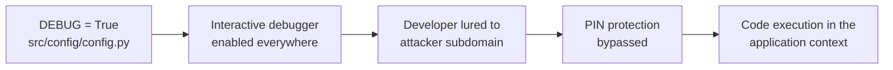
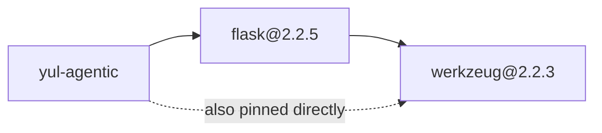

# Debugger remote code execution in Werkzeug 2.2.3 — CVE-2024-34069

    

Werkzeug is a comprehensive WSGI web application library. The debugger in affected versions of Werkzeug can allow an attacker to execute code on a developer's machine under some circumstances. This requires the attacker to get the developer to interact with a domain and subdomain they control, and enter the debugger PIN, but if they are successful it allows access to the debugger even if it is only running on localhost. This also requires the attacker to guess a URL in the developer's application that will trigger the debugger.

## High Level Details

|                             |                                                                          |
|-----------------------------|--------------------------------------------------------------------------|
| **Affected component**      | `pyproject.toml` → `werkzeug==2.2.3` · `src/config/config.py` → `DEBUG`   |
| **Vulnerability**           | [CVE-2024-34069](https://nvd.nist.gov/vuln/detail/CVE-2024-34069) — debugger PIN bypass |
| **CVSS 3.1**                | **7.5 High** · `CVSS:3.1/AV:N/AC:H/PR:N/UI:R/S:U/C:H/I:H/A:H`             |
| **Fixed in**                | Werkzeug 3.0.3                                                            |
| **Remediation**             | Coordinated bump to Werkzeug 3.x + Flask 3.x, and stop hardcoding `DEBUG` |
| **Effort**                  | Medium — major-version bump across two packages                           |
| **Detected by**             | Snyk Open Source (SCA) · nightly scheduled scan                           |

## Finding

Werkzeug before 3.0.3 is vulnerable to [CVE-2024-34069](https://nvd.nist.gov/vuln/detail/CVE-2024-34069). The interactive debugger's PIN protection can be defeated when a developer is lured to an attacker-controlled domain and subdomain, granting the attacker code execution in the context of the running application — even when the server is bound to localhost only.

The pin in `pyproject.toml` is `2.2.3`, which is below the fixed 3.0.3.

<b>Data flow and dependency path</b>

## Acceptance criteria

- [ ] `pyproject.toml` pins `werkzeug>=3.0.3` **and** `flask>=3.0` — the bump is coordinated.
- [ ] `uv.lock` and `requirements.txt` are regenerated against the new pins.
- [ ] `DEBUG` is read from the `FLASK_DEBUG` environment variable and defaults to off.
- [ ] The application boots on Flask 3.x and the test suite passes.
- [ ] The container built from `Dockerfile` no longer serves the interactive debugger by default.

## References

- [GitHub Advisory GHSA-2g68-c3qc-8985](https://github.com/advisories/GHSA-2g68-c3qc-8985)
- [National Vulnerability Database — CVE-2024-34069](https://nvd.nist.gov/vuln/detail/CVE-2024-34069)
